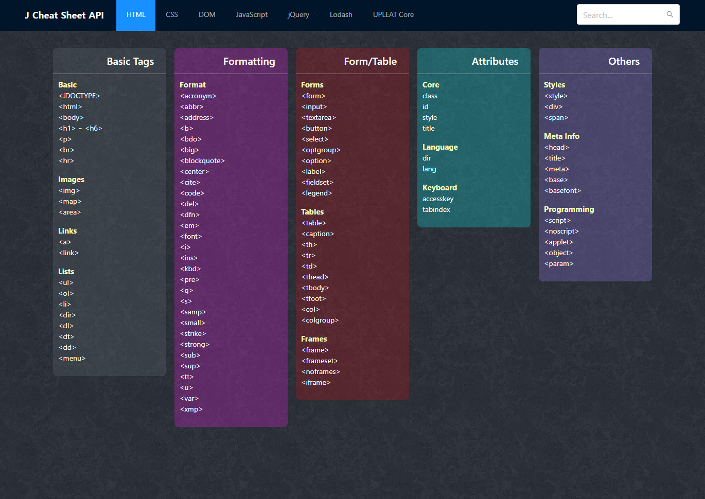

# j-cheat-sheet-api
> 각종 프로그래밍 언어별 차트시트 관련 API 웹 어플리케이션 입니다.

## preview


### Vue Cli install
```
$ npx @vue/cli create {project}
```

### Project setup
```
$ npm install
```

### Compiles and hot-reloads for development
```
$ npm run serve
```

### Compiles and minifies for production
```
$ npm run build
```

### Run your tests
```
$ npm run test
```

### Lints and fixes files
```
$ npm run lint
```

### Customize configuration
See [Configuration Reference](https://cli.vuejs.org/config/).
